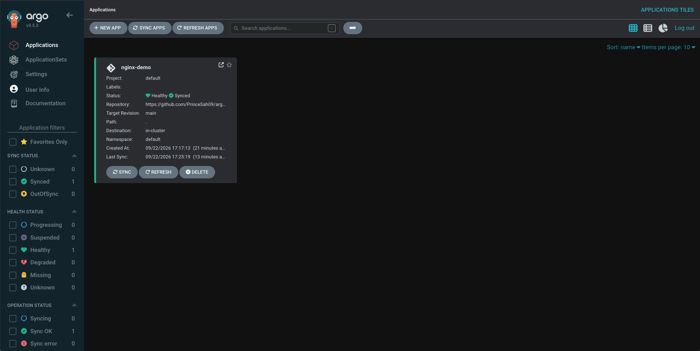
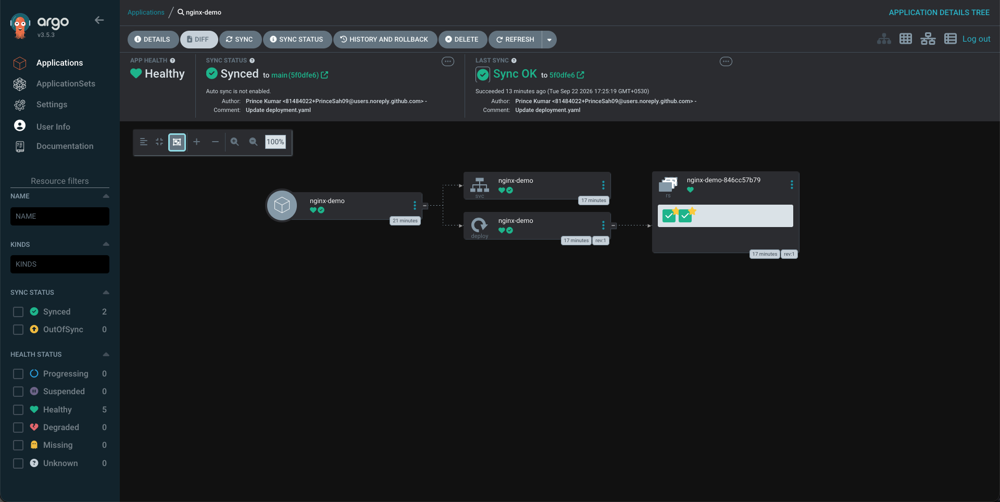

# 07 — Deploy Nginx with Argo CD

## What are we doing?

In the previous step we created the Argo CD Application. Argo CD knows about it, but has not deployed anything yet — the sync policy is Manual.

In this step we will:
1. Perform the first sync (deploy nginx to Kubernetes)
2. Verify the Deployment and Pods are running
3. Access nginx in the browser
4. Understand Synced + Healthy

---

## Step 1 — Sync via the UI

In the Argo CD UI, find the `nginx-demo` application card.

Click the **SYNC** button.

A panel appears on the right. Leave all defaults as-is and click **SYNCHRONIZE**.

**What happens when you click Sync:**

```
Argo CD
  │
  │ 1. repo-server fetches the manifests from Git
  │    (deployment.yaml + service.yaml)
  │
  ▼
  │ 2. application-controller calls the Kubernetes API
  │    kubectl apply -f deployment.yaml
  │    kubectl apply -f service.yaml
  │
  ▼
Kubernetes API
  │
  │ 3. Creates the Deployment resource
  │    Creates the Service resource
  │
  ▼
Kubernetes Scheduler
  │
  │ 4. Schedules 2 Pods onto the node
  │
  ▼
Pods start running nginx:1.27
```

---

## Step 2 — Sync via CLI (alternative)

If you prefer the command line:

```bash
argocd app sync nginx-demo
```

Or using kubectl to trigger a sync by annotating the app (no argocd CLI required):

```bash
argocd login localhost:8080 --insecure --username admin --password <your-password>
argocd app sync nginx-demo
```

---

## Step 3 — Verify in Kubernetes

Open a new terminal and run:

```bash
kubectl get deployment nginx-demo
```

**What this does:** Shows the `nginx-demo` Deployment.

**Expected output:**

```
NAME         READY   UP-TO-DATE   AVAILABLE   AGE
nginx-demo   2/2     2            2           30s
```

| Column | Meaning |
|--------|---------|
| `READY` | `2/2` means 2 Pods desired, 2 Pods ready |
| `UP-TO-DATE` | Pods running the latest configuration |
| `AVAILABLE` | Pods available to serve traffic |

---

```bash
kubectl get pods
```

**What this does:** Lists Pods in the `default` namespace.

**Expected output:**

```
NAME                          READY   STATUS    RESTARTS   AGE
nginx-demo-6d9f8b7c5-abc12    1/1     Running   0          45s
nginx-demo-6d9f8b7c5-xyz99    1/1     Running   0          45s
```

Two Pods are running. The random suffixes (`abc12`, `xyz99`) are generated by Kubernetes.

---

```bash
kubectl get svc nginx-demo
```

**What this does:** Shows the nginx-demo Service.

**Expected output:**

```
NAME         TYPE        CLUSTER-IP     EXTERNAL-IP   PORT(S)   AGE
nginx-demo   ClusterIP   10.96.x.x      <none>        80/TCP    45s
```

`EXTERNAL-IP` is `<none>` because ClusterIP services are internal-only. That is expected.

---

## Step 4 — Check Argo CD status

```bash
kubectl get applications -n argocd
```

**Expected output:**

```
NAME         SYNC STATUS   HEALTH STATUS
nginx-demo   Synced        Healthy
```

In the UI, the application card should now show a green **Synced** and green **Healthy**:



The card shows exactly what Argo CD knows about the app:
- **Status:** Healthy + Synced
- **Repository:** your GitHub repo URL
- **Target Revision:** `main`
- **Path:** `.` (or `06-first-application` if you used this repo)
- **Destination:** `in-cluster`
- **Namespace:** `default`

### What does Synced + Healthy mean?

```
Synced
  └── Git and Kubernetes match perfectly
        deployment.yaml → Deployment exists with exact same spec
        service.yaml    → Service exists with exact same spec

Healthy
  └── The actual Kubernetes resources are working correctly
        Deployment → 2/2 Pods ready
        Service    → has valid endpoints
        Pods       → Status: Running
```

These are two separate things:
- **Synced** is about whether Git matches Kubernetes
- **Healthy** is about whether the resources are actually working

You could be Synced but Degraded (deployed exactly what Git says, but the app is crashing).

---

## Step 5 — Access Nginx in your browser

The Service is type `ClusterIP` — it is only accessible inside the cluster. Use `kubectl port-forward` to reach it from your laptop.

```bash
kubectl port-forward svc/nginx-demo 8081:80
```

**What this does:** Forwards your local port `8081` to port `80` on the nginx-demo Service.

```
Browser
  │
  │ http://localhost:8081
  ▼
kubectl port-forward
  │
  ▼
nginx-demo Service (ClusterIP:80)
  │
  ├──► nginx Pod 1 (port 80)
  └──► nginx Pod 2 (port 80)
```

Open your browser:

```
http://localhost:8081
```

You should see the Nginx welcome page:

```
Welcome to nginx!

If you see this page, the nginx web server is successfully installed and
working. Further configuration is required.
```

**Note:** Keep this port-forward running while you want to access Nginx. Keep the argocd port-forward running too. You will need two terminal tabs.

---

## Step 6 — Inspect the app in the Argo CD UI

Click on the `nginx-demo` card in the Argo CD UI.

You will see a visual resource tree of everything Argo CD is managing for this application:



The tree shows:

```
Application: nginx-demo   [Healthy] [Synced]
  │
  ├── Service: nginx-demo        [Synced] [Healthy]
  │
  └── Deployment: nginx-demo     [Synced] [Healthy]
        └── ReplicaSet: nginx-demo-846cc57b79
              └── Pods (shown as green checkmarks)
```

Notice the top bar gives you:
- **APP HEALTH** — green heart = Healthy
- **SYNC STATUS** — green checkmark = Synced to `main` at the latest commit hash
- **LAST SYNC** — when the last sync succeeded, which commit, and who authored it

You can click any node in the tree to see its live YAML, events, and logs directly in the UI — no `kubectl` needed.

---

## The full flow — what just happened

```
1. You wrote deployment.yaml and service.yaml
         │
         ▼
2. You pushed them to GitHub
         │
         ▼
3. You created an Argo CD Application pointing at that repo + path
         │
         ▼
4. Argo CD fetched the files from Git → OutOfSync + Missing
         │
         ▼
5. You clicked Sync
         │
         ▼
6. Argo CD applied the manifests to Kubernetes
         │
         ▼
7. Kubernetes created the Deployment and Service
         │
         ▼
8. Kubernetes started 2 Nginx Pods
         │
         ▼
9. Argo CD detected everything matches → Synced + Healthy
         │
         ▼
10. You accessed Nginx at localhost:8081
```

---

## Troubleshooting

**Pods stuck in `Pending`**
```bash
kubectl describe pod <pod-name>
```
Look at the Events section. Usually a resource constraint on the Kind node.

**Pods in `ImagePullBackOff`**
```bash
kubectl describe pod <pod-name>
```
Docker cannot pull `nginx:1.27`. Check your internet connection.

**Argo CD still shows OutOfSync after Sync**
```bash
kubectl describe application nginx-demo -n argocd
```
Look at the `Conditions` and `Status` sections. Usually a YAML error or wrong path.

**App shows Synced but Pods are not Running**
```bash
kubectl get pods
kubectl describe pod <pod-name>
kubectl logs <pod-name>
```

**Port-forward stops working**
→ Restart with `kubectl port-forward svc/nginx-demo 8081:80`

---

## Quick reference for this lab

```bash
# Check the application status
kubectl get applications -n argocd

# Check pods
kubectl get pods

# Check deployment
kubectl get deployment nginx-demo

# Check service
kubectl get svc nginx-demo

# Access nginx
kubectl port-forward svc/nginx-demo 8081:80

# See resource details
kubectl describe deployment nginx-demo
kubectl describe svc nginx-demo

# See pod logs
kubectl logs <pod-name>
```

---

Next step: [08 — Experiments](../08-experiments/README.md)
